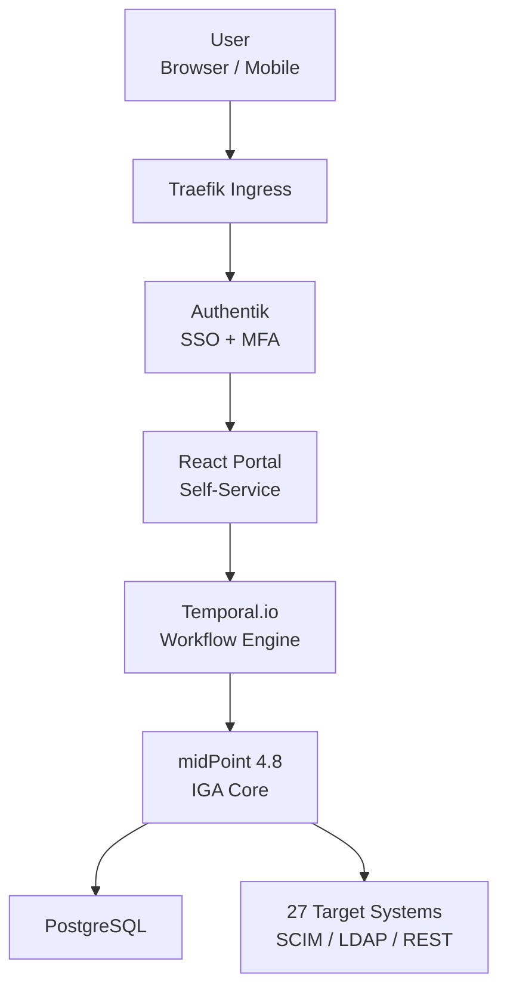

# GreenAgroWise_IGA/IDM 

## Project Overview
Open-source **Identity Governance & Administration** platform designed for large-scale agribusiness enterprises.  
Provides full lifecycle management of identities and access to 27 corporate systems in compliance with industry best practices and regulatory requirements.

### Key Features
| Category               | Implementation                                                      |
|------------------------|---------------------------------------------------------------------|
| Users                  | 1000+ accounts, automated Joiner–Mover–Leaver processes             |
| Roles & Access         | 83 business roles, RBAC, 10 critical Segregation of Duties (SoD) rules|
| Workflow               | 5-stage approval process                                            |
| Recertification        | Quarterly access review campaigns with auto-revocation              |
| Self-Service Portal    | Desktop + Mobile PWA (React + Material-UI)                          |
| Integrations           | 27 systems: SAP S/4HANA, 1C, Microsoft 365, ФГИС Зерно, ServiceNow |
| Compliance             | SOX 404, GDPR, 152-ФЗ (Russia), FSTEC audit ready                   |

 ### System Architecture

### Technology Stack
Component,Technology,Purpose
IGA Engine,Evolveum midPoint 4.8,"Roles, SoD, recertification, connectors"
Identity Provider,Authentik 2025,"Authentication, OIDC/SAML, MFA"
Workflow Orchestrator,Temporal.io 1.25,"Long-running approval workflows, escalations"
Frontend,React 18 + TypeScript + MUI,Self-service portal (PWA)
Backend,Go 1.23 + Python 3.12,Business logic & custom integrations
Database,PostgreSQL 16,Primary data storage
Containerization,Docker Compose (K8s-ready),Local & production deployment

### Use Cases
Automated onboarding with birthright access in < 24 hours
Multi-level access requests to restricted systems (e.g., SAP, OpenLink Endur)
Quarterly access recertification with automatic revocation
Self-service password reset and role requests
Full audit trail for SOX/GDPR/152-ФЗ compliance

### Quick Start
git clone https://github.com/pankinasw/GreenAgroWise_IGA-IDM.git
cd GreenAgroWise_IGA-IDM
cp .env.example .env
docker compose up -d

### Documentation
Technical Specification
User Guide
Administrator Guide
Architecture & Threat Model

### Expansion Capabilities
# Integration Potential:
* ## FGIS Mercury Integration** - possibility to connect to the Federal State Information System Mercury for traceability and control of food products
* ## Marking System Integration** - support for "Cheстный ЗНАК" (Honest MARK) system for product marking and tracking
* ## Government Systems Integration** - compatibility with other state information systems for data exchange and compliance

Security Analytics:
* ## User Behavior Analytics (UBA)** implementation for monitoring and analyzing user activity patterns
* ## Anomaly Detection** system to track unusual user behavior
* ## Proactive Threat Detection** mechanisms to identify potential security incidents in advance

Cryptographic Protection:
* ## CryptoPro CSP Support** integration for enhanced cryptographic security
* ## GOST Algorithms Implementation** for compliance with Russian cryptographic standards
* ## Advanced Data Protection** measures to ensure secure data storage and transmission

These capabilities can be integrated into the system as additional modules, providing flexibility for future development and customization according to specific project requirements.

© 2025 pankinasw · MIT License
