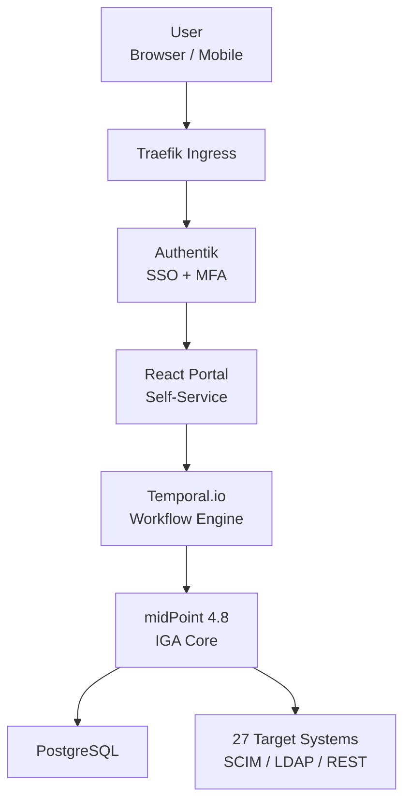

### GreenAgroWise_IGA/IDM 

**Corporate-grade open-source Identity Governance & Administration (IGA) platform**  
designed for centralized identity and access management in large-scale agribusiness holdings and distributed production environments.

The platform delivers **full-lifecycle identity and access governance** (Joiner–Mover–Leaver), automates request workflows, access recertification, auditing, and supports integration with **27 corporate and government systems**.

СУПД has been engineered from the ground up with strict adherence to:
- Information security requirements  
- Corporate compliance policies  
- Regulatory standards and industry best practices (SOX 404, GDPR, 152-ФЗ, ФСТЭК)

The solution is production-ready for environments with heightened access-control demands, mandatory segregation of duties (SoD), comprehensive action traceability, and seamless regulatory audit preparedness.

### Key Features
| Category               | Implementation                                                      |
|------------------------|---------------------------------------------------------------------|
| Users                  | 1000+ accounts, automated Joiner–Mover–Leaver processes             |
| Roles & Access         | 83 business roles, RBAC, 10 critical Segregation of Duties (SoD) rules|
| Workflow               | 5-stage approval process                                            |
| Recertification        | Quarterly access review campaigns with auto-revocation              |
| Self-Service Portal    | Desktop + Mobile PWA (React + Material-UI)                          |
| Integrations           | 27 systems: SAP S/4HANA, 1C, Microsoft 365, ФГИС Зерно, ServiceNow |
| Compliance             | SOX 404, GDPR, 152-ФЗ (Russia), FSTEC audit ready                   |

 ### System Architecture

### Technology Stack
| Component           | Technology                   | Purpose                                                         |
|---------------------|------------------------------|-----------------------------------------------------------------|
| IGA Engine          | Evolveum midPoint 4.8        | Roles, SoD, recertification, connectors                         |
| Identity Provider   | Authentik 2025               | Authentication, OIDC/SAML, MFA                                  |
| Workflow Orchestrator | Temporal.io 1.25            | Long-running approval workflows                                 |
| Frontend            | React 18 + TypeScript + MUI   | Self-service portal (PWA)                                        |
| Backend             | Go 1.23 + Python 3.12         | Business logic & custom integrations                            |
| Database            | PostgreSQL 16                | Primary data storage                                            |
| Containerization    | Docker Compose (K8s-ready)    | Local & production deployment                                   |

### Use Cases — Real-World Scenarios

| # | Scenario                                                    | How it works in GreenAgroWise IGA/IDM                                                                                         | Business Impact                                      |
|---|------------------------------------------------------------|-------------------------------------------------------------------------------------------------------------------------------|------------------------------------------------------|
| 1 | **Automated employee onboarding**                          | New hire appears in 1C HR → automatic sync → midPoint creates account and assigns birthright roles (M365, 1C, corporate email) within 1 hour | New employee is fully productive on day one          |
| 2 | **Multi-level access request to restricted systems**       | User requests “Trader” role in OpenLink Endur or “Chief Accountant 1C” → 5-stage workflow starts: line manager → company security → holding security → system owner → automatic SCIM/LDAP provisioning | Zero unauthorized access, full approval audit trail  |
| 3 | **Quarterly access recertification**                       | midPoint automatically launches campaign → managers receive list of subordinates and their roles → confirm/revoke via portal → expired roles auto-revoked after 14 days | 100 % coverage, zero “ghost” accounts                |
| 4 | **Employee self-service**                                  | Users can independently:  • request temporary/project access  • password Reset Request Creation (executed by IT service)  • view current roles & history  • delegate rights during vacation | 5–10× reduction of IT & security team workload       |
| 5 | **Incident response – compromised account**                 | Suspicious activity detected (Wazuh/Temporal) → immediate block in Authentik + revocation of all sessions & tokens → security team notified | Response time < 15 minutes, damage minimized         |
| 6 | **Audit & regulatory reporting**                            | Generate ready-to-use reports in 2 minutes:  • SoD conflict registry  • Full executive access list  • Change history per quarter | Instant readiness for SOX 404, GDPR, 152-FZ, FSTEC audits |

### Quick Start
git clone https://github.com/pankinasw/GreenAgroWise_IGA-IDM.git
cd GreenAgroWise_IGA-IDM
cp .env.example .env
docker compose up -d

### Documentation

| Document                          | Description                                                      | Link                                                    |
|-----------------------------------|------------------------------------------------------------------|---------------------------------------------------------|
| **Technical Specification**       | Full project requirements, functional and non-functional specs   | [`docs/technical-specification.md`](./docs/technical-specification.md) |
| **User Guide**                    | Step-by-step instructions for employees and approvers            | [`docs/user-guide.md`](./docs/user-guide.md)            |
| **Administrator Guide**           | Deployment, configuration, maintenance and troubleshooting       | [`docs/admin-guide.md`](./docs/admin-guide.md)          |
| **Architecture Overview**         | High-level and detailed architecture diagrams (Draw.io source)   | [`docs/architecture.drawio`](./docs/architecture.drawio) |
| **Threat Model (STRIDE)**         | Security analysis and mitigation matrix                          | [`docs/threat-model-stride.md`](./docs/threat-model-stride.md) |
| **API Reference (OpenAPI 3.0.3, 25+ endpoints)**                 | OpenAPI/Swagger spec for backend services                        | [`docs/api/openapi.yaml`](./docs/api/openapi.yaml)      |

All documents are written in Markdown and can be easily exported to PDF.

### Expansion Capabilities
## Integration Potential:
*  FGIS Mercury Integration** - possibility to connect to the Federal State Information System Mercury for traceability and control of food products
*  Marking System Integration** - support for "Cheстный ЗНАК" (Honest MARK) system for product marking and tracking
*  Government Systems Integration** - compatibility with other state information systems for data exchange and compliance

## Security Analytics:
* User Behavior Analytics (UBA)** implementation for monitoring and analyzing user activity patterns
* Anomaly Detection** system to track unusual user behavior
* Proactive Threat Detection** mechanisms to identify potential security incidents in advance

## Cryptographic Protection:
* CryptoPro CSP Support** integration for enhanced cryptographic security
* GOST Algorithms Implementation** for compliance with Russian cryptographic standards
* Advanced Data Protection** measures to ensure secure data storage and transmission

These capabilities can be integrated into the system as additional modules, providing flexibility for future development and customization according to specific project requirements.

© 2025 pankinasw · MIT License
