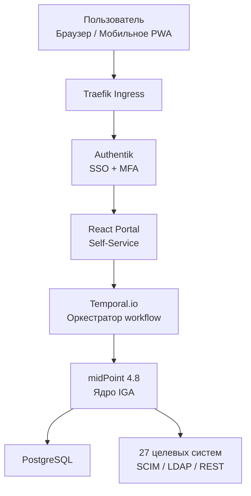

### СУПД — Cистема управления правами доступа (IGA/IDM)

Enterprise-платформа класса Identity Governance & Administration (IGA) с открытым исходным кодом, предназначенная для централизованного управления идентификацией и доступами в крупных агрохолдингах и распределённых производственных структурах.

Платформа обеспечивает полный жизненный цикл учётных записей и прав доступа (Joiner–Mover–Leaver), автоматизирует согласование, ресертификацию и аудит доступов, а также управляет интеграциями с 27 корпоративными и государственными системами.

СУПД изначально спроектирована с учётом требований:

### информационной безопасности,

### корпоративного комплаенса,

### регуляторных норм и отраслевых стандартов.

Решение полностью готово к использованию в среде с повышенными требованиями к контролю доступов, разделению обязанностей (SoD), трассируемости действий и подготовке к регуляторным проверкам.

### Ключевые возможности

| Категория               | Реализация                                                                                     |
|-------------------------|------------------------------------------------------------------------------------------------|
| Пользователи            | 1000+ учётных записей, автоматизация процессов Joiner–Mover–Leaver                             |
| Роли и доступы          | 83 бизнес-роли, RBAC, 10 критических правил разделения обязанностей (SoD)                      |
| Согласование            | 5-этапный workflow с таймаутами и эскалацией                                                  |
| Ресертификация          | Ежеквартальные кампании с автоматическим отзывом просроченных доступов                         |
| Портал самообслуживания | Desktop + Mobile PWA (React 18 + Material-UI)                                                  |
| Интеграции              | 27 систем: SAP S/4HANA, 1С:ERP, Microsoft 365, ФГИС Зерно, ServiceNow и др.                     |
| Соответствие требованиям| SOX 404, GDPR, 152-ФЗ, требования ФСТЭК — готовность к аудиту                                  |

### Архитектура системы



### Технологический стек

| Компонент                 | Технология                     | Назначение                                                    |
|---------------------------|--------------------------------|---------------------------------------------------------------|
| Движок IGA                | Evolveum midPoint 4.8          | Роли, SoD, ресертификация, коннекторы                         |
| Провайдер идентификации   | Authentik 2025                 | Аутентификация, OIDC/SAML, MFA                                |
| Оркестратор процессов    | Temporal.io 1.25               | Долгоживущие процессы согласования                            |
| Фронтенд                  | React 18 + TypeScript + MUI    | Self-service портал (PWA)                                     |
| Бэкенд                    | Go 1.23 + Python 3.12          | Бизнес-логика и кастомные интеграции                          |
| База данных               | PostgreSQL 16                  | Основное хранилище                                            |
| Контейнеризация           | Docker Compose (K8s-ready)     | Локальное и продуктивное развёртывание                        |

### Реальные сценарии использования

| № | Сценарий                                      | Как работает в ЦСУПД                                                                                 | Бизнес-эффект                                  |
|---|-----------------------------------------------|------------------------------------------------------------------------------------------------------|------------------------------------------------|
| 1 | Автоматизация приёма сотрудника               | Новый сотрудник появляется в 1С:ЗУП → автосинхронизация → midPoint создаёт УЗ и выдаёт базовые роли доступа в течение 1 часа | Сотрудник полностью готов к работе с первого дня |
| 2 | Многоуровневая заявка на доступ к критичным системам | Запрос роли «Трейдер» или «Главный бухгалтер 1С» → запускается 5-этапный workflow → автоматическая настройка | 100 % согласованный доступ, полный аудит       |
| 3 | Ежеквартальная ресертификация                 | midPoint автоматически запускает кампанию → руководители подтверждают/отзывают → автоотзыв через 14 дней | 100 % охват, ликвидация «мёртвых душ»          |
| 4 | Самообслуживание сотрудников                  | Сотрудник сам запрашивает временный доступ, создает заявки на сброс пароля (исполняется ИТ-службой), видит свои роли и историю            | Снижение нагрузки на ИТ и ИБ в 5–10 раз        |
| 5 | Реагирование на инцидент — скомпрометированная УЗ | Обнаружена подозрительная активность → мгновенная блокировка в Authentik + отзыв всех токенов       | Время реакции < 15 минут, минимизация ущерба   |
| 6 | Аудит и регуляторная отчётность               | За 2 минуты формируются готовые отчёты: реестр SoD, полный список доступов, история изменений       | Мгновенная готовность к проверкам              |

### Быстрый старт

```bash
git clone https://github.com/pankinasw/GreenAgroWise_IGA-IDM.git
cd GreenAgroWise_IGA-IDM
cp .env.example .env
docker compose up -d
```

### Документация

| Документ                                   | Описание                                                             | Ссылка                                                  |
|--------------------------------------------|----------------------------------------------------------------------|---------------------------------------------------------|
| **Техническое задание**                    | Полные требования, функциональные и нефункциональные спецификации    | [`docs/Техническое_задание.md`](./docs/Техническое_задание.md) |
| **Руководство пользователя**               | Пошаговые инструкции для сотрудников и согласующих                  | [`docs/Руководство_пользователя.md`](./docs/Руководство_пользователя.md) |
| **Руководство администратора**             | Развёртывание, настройка, сопровождение                              | [`docs/Руководство_администратора.md`](./docs/Руководство_администратора.md) |
| **Обзор архитектуры**                      | Высокоуровневые и детальные схемы (исходник Draw.io)                  | [`docs/architecture.drawio`](./docs/architecture.drawio) |
| **Модель угроз (STRIDE + DREAD)**          | Анализ безопасности и матрица рисков                                 | [`docs/threat-model-stride.md`](./docs/threat-model-stride.md) |
| **API Reference (OpenAPI 3.0.3, 25+ эндпоинтов)** | Спецификация REST API бэкенда                                   | [`docs/api/openapi.yaml`](./docs/api/openapi.yaml)      |

Все документы написаны в Markdown и легко экспортируются в PDF.

### Возможности расширения (могут быть подключены как дополнительные модули)

#### Интеграционный потенциал:
- Подключение к **ФГИС Меркурий** — прослеживаемость продукции
- Интеграция с системой **Честный ЗНАК** — маркировка товаров
- Совместимость с другими государственными системами

#### Аналитика безопасности:
- User Behavior Analytics (UBA)
- Обнаружение аномалий
- Проактивное выявление угроз

#### Криптографическая защита:
- Поддержка **КриптоПро CSP**
- Реализация алгоритмов ГОСТ
- Расширенные средства защиты данных


© 2025 pankinasw · Лицензия MIT
```

